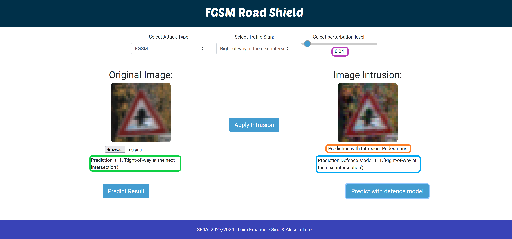

# FGSM Attack on CNN - Software Engineering for AI Project

This project was developed by the **University of Salerno** for the **Software Engineering for AI** course. The aim is to analyze the impact of the **Fast Gradient Sign Method (FGSM)** attack on Convolutional Neural Networks (CNNs), to examine how a network behaves under this attack, and to defend against it by training a more robust model.

## Authors
Alessia Ture
Luigi Emanuele Sica

## Project Structure
: Contains the image of our developed web application which demonstrates how, given an input image and an imperceptible perturbation applied to it, the prediction of the perturbed image with the base model is completely different (in orange), whereas with the robust model the prediction turns out to be correct (in blue). It also shows that the robust model maintains good performance despite the attack.

## Prerequisites
To run the code, you need to:
1. Download the DataSet: https://bitbucket.org/jadslim/german-traffic-signs/src/master/
2. Download the required library dependencies present in the`requirements.txt ` file.
2. Create the following files by un-commenting the code in the `fgsm.py` file:
   - `x_adversarial_test.npy`
   - `x_adversarial_train.npy`
   - `x_adversarial_val.npy`
   - `y_adversarial_test.npy`
   - `y_adversarial_train.npy`
   - `y_adversarial_val.npy`

## Model Training
To train the two models, the base and the robust model, un-comment the code in the `fgsm.py` file.

## Execution
To launch the web application, run the command:
```bash
python app.py


